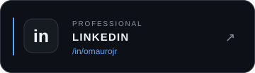

<p align="center">
  
</p>

<h3 align="center">
  Product Engineer Pleno • Fullstack Developer • Software Architect • AI-First Builder
</h3>

<p align="center">
  Building digital products end-to-end — from idea and architecture to frontend, backend and production.
</p>

<p align="center">
  <a href="https://www.linkedin.com/in/omaurojr" target="_blank">
    
  </a>
  <a href="https://www.instagram.com/omauro.jr" target="_blank">
    
  </a>
  <a href="https://www.orbitadev.com.br" target="_blank">
    
  </a>
</p>

---

## About Me

> I'm **Carlos Mauricio**, a **Product Engineer Pleno** who builds digital products from concept to production.
>
> My work sits at the intersection of **product thinking**, **fullstack development**, **software architecture** and **AI-first execution**.
>
> I like designing systems that are not only functional, but also **scalable**, **maintainable** and **experience-driven**.

---

## What I Do

<table>
  <tr>
    <td width="50%" valign="top">
      <h3>🧠 Product Engineering</h3>
      Transforming ideas into real products with technical and product vision.
    </td>
    <td width="50%" valign="top">
      <h3>⚙️ Fullstack Development</h3>
      Building modern frontends, robust backends and production-ready systems.
    </td>
  </tr>
  <tr>
    <td width="50%" valign="top">
      <h3>🏗️ Software Architecture</h3>
      Structuring scalable applications, integrations and maintainable codebases.
    </td>
    <td width="50%" valign="top">
      <h3>🤖 AI-First Building</h3>
      Leveraging LLMs and AI workflows to accelerate delivery and improve execution.
    </td>
  </tr>
</table>

---

## 🧰 Tech Stack

<p align="center">
  
</p>

<br>

<table align="center">
  <tr>
    <td align="center" width="300">
      <strong>Frontend</strong>
      <br><br>
      
    </td>
    <td align="center" width="300">
      <strong>Backend</strong>
      <br><br>
      
    </td>
  </tr>

  <tr>
    <td align="center" width="300">
      <strong>Language & Database</strong>
      <br><br>
      
    </td>
    <td align="center" width="300">
      <strong>Cloud & Infrastructure</strong>
      <br><br>
      
    </td>
  </tr>
</table>

---

## AI Stack

<p align="center">
  
  
  
</p>

<p align="center">
  <sub>
    AI-assisted engineering • architecture exploration • rapid prototyping • development workflows
  </sub>
</p>

---

## Core Focus

<p align="center">
  
  
  
  
  
  
</p>

---

## GitHub Analytics

<p align="center">
  
  
</p>

<p align="center">
  
</p>

---

## Contribution Snake

<p align="center">
  
</p>

---

## Signature

```txt
Building products from idea → architecture → code → production
```
---
